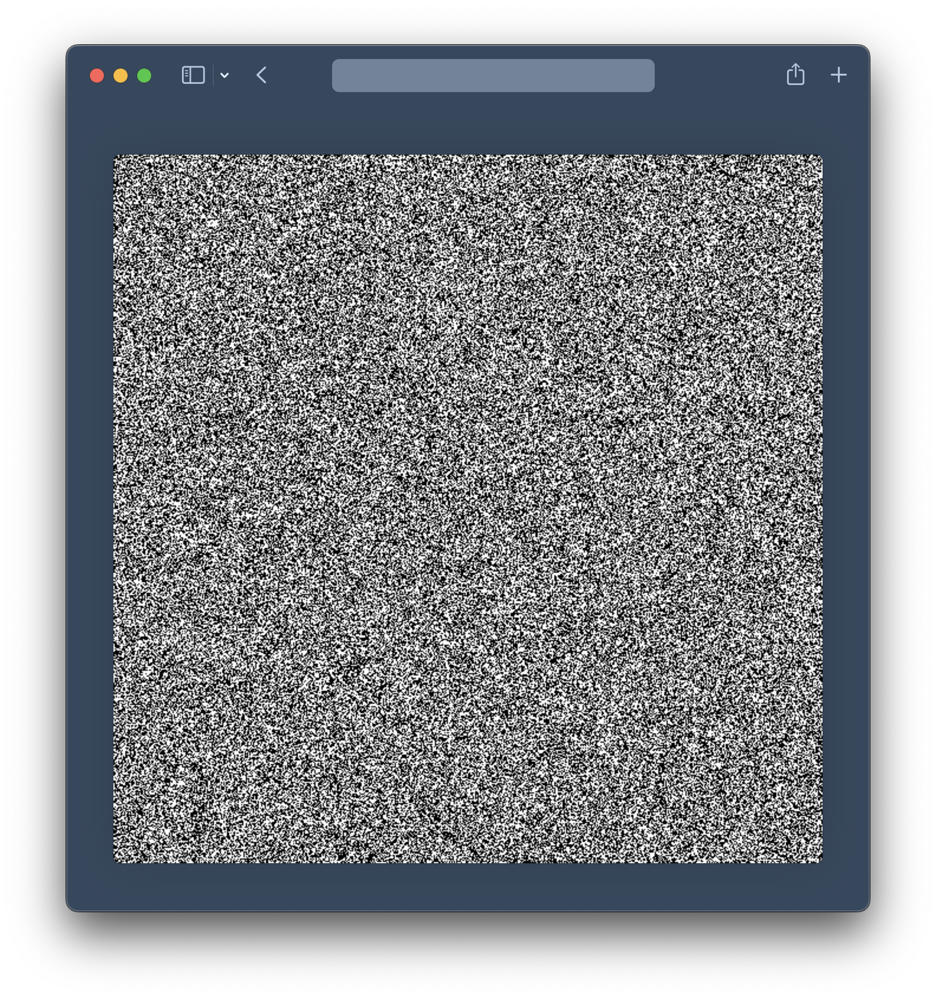

# JS WASM Noise
Noise effect using [WebAssembly](https://webassembly.org/) and [AssemblyScript](https://www.assemblyscript.org/).

 

  
 

 <a href="https://leandrosq.github.io/js-wasm-noise/">Live demo here</a>

